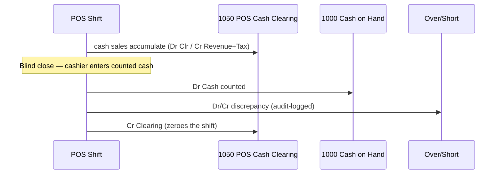
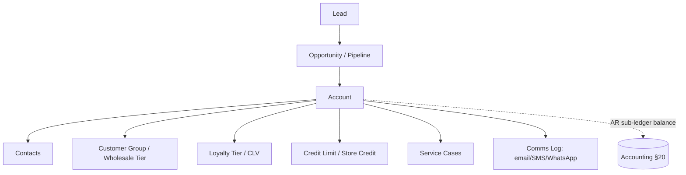
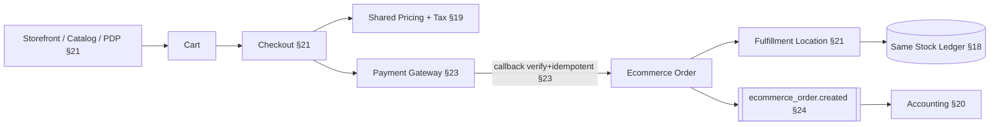

# Accounting, CRM & Ecommerce Architecture

- **Status:** Planning (design only — no implementation code)
- **Date:** 2026-06-21
- **Charter refs:** §3, §14, §19, §20, §21, §24
- **Scope:** Double-entry accounting (§20), CRM (§21), ecommerce on the shared inventory ledger (§21). Posting flows reference the shared-core principle (§3) and posting-period-vs-server-time authority (§14).

> Design/planning document. Tables, Mermaid, and pseudocode below are illustrative — not implementation. The stock-ledger truth, money rules, and event/outbox seams these modules ride on are fixed by ADR 0003 and the charter; this doc shows how Accounting, CRM, and Ecommerce compose on top without forking the core.

---

## 1. First principles (why these three are one document)

The charter forbids bolting these on later (§3: "Accounting, inventory, CRM, procurement, assets, ecommerce, POS, warehousing, and reporting must share one domain model"). Concretely:

- **Accounting is downstream of events, never of UI.** Every postable business action emits a domain event (§24); the accounting engine subscribes and posts balanced journals. Accounting never reaches into POS/inventory tables directly.
- **Ecommerce is POS by another channel.** Same products, same prices, same tax engine, same stock ledger (§21: "Never create separate ecommerce inventory"). Only the *front door* (storefront/cart/checkout) and the *fulfillment location* differ.
- **CRM is the customer's spine.** Accounts/contacts, credit limits, store credit, and loyalty are referenced by both POS sales and ecommerce orders; AR sub-ledger balances tie back to CRM account balances.

```mermaid
flowchart LR
  subgraph Channels
    POS[POS Sale §19]
    ECOM[Ecommerce Order §21]
  end
  subgraph Shared Core §3
    PRICE[Pricing + Tax Engine §19]
    STOCK[(Stock Ledger §18 — single DB)]
    CRMACCT[(CRM Account / AR §21)]
  end
  OUTBOX[[Outbox / Domain Events §24]]
  ACCT[Accounting Engine §20]
  POS --> PRICE --> STOCK
  ECOM --> PRICE
  ECOM --> STOCK
  POS --> CRMACCT
  ECOM --> CRMACCT
  POS --> OUTBOX
  ECOM --> OUTBOX
  STOCK --> OUTBOX
  OUTBOX --> ACCT
  ACCT --> GL[(General Ledger §20)]
```

---

## 2. Double-entry accounting (§20)

### 2.1 Non-negotiables (from charter + ADR 0003)

- **Double-entry from day one** (§20, §33). Every posting balances; an unbalanced journal is rejected and raises a critical alert (§25).
- **Money = integer minor units** with amount + currency code + minor-unit scale stored together; never floats; one rounding policy; no assumption of two decimals (§19/§33, ADR 0003 §4).
- **Server time is authoritative for posting time and period assignment** (§14/§33). Offline device clocks are untrusted (see §7 of this doc).
- **Append-only, audit-ready.** GL entries are immutable; corrections are reversing entries, never edits (§14, §25).

### 2.2 Chart of accounts (COA)

Tenant/company-scoped, hierarchical, with account *type* (asset/liability/equity/income/expense) and *system role* tags so engine postings resolve accounts by role, not by hardcoded code. Seeded via the Chart of Accounts wizard (§5).

| Account (illustrative) | Type | System role | Used by |
| --- | --- | --- | --- |
| 1000 Cash on Hand | Asset | `cash` | POS drawer, payments |
| 1010 Bank — Operating | Asset | `bank` | reconciliation |
| 1050 POS Cash Clearing | Asset | `pos_cash_clearing` | shift settlement |
| 1100 Accounts Receivable | Asset | `ar_control` | AR sub-ledger control |
| 1200 Inventory Asset | Asset | `inventory_asset` | stock ledger valuation |
| 1250 Freight Clearing | Asset | `freight_clearing` | landed cost |
| 1260 Duty/Customs Clearing | Asset | `duty_clearing` | bonded → released |
| 2000 Accounts Payable | Liability | `ap_control` | AP sub-ledger control |
| 2100 VAT/GST Payable | Liability | `tax_payable` | tax engine output |
| 2150 Duty Payable | Liability | `duty_payable` | import/customs |
| 2300 Gift Card / Store Credit Liability | Liability | `customer_liability` | §19 liabilities |
| 4000 Sales Revenue | Income | `sales_revenue` | POS + ecommerce |
| 5000 COGS | Expense | `cogs` | stock-out valuation |
| 7900 FX Gain/Loss | Income/Exp | `fx_gain_loss` | revaluation |

`system role → account` mapping is per company and editable behind an approval (§22). The engine fails closed (raises "missing account mapping" data-quality alert §26) rather than guessing.

### 2.3 GL, journals, and sub-ledgers

- **General Ledger** — immutable posting lines (account, debit, credit, currency, fx rate, period, source event, correlation_id).
- **Journals** — header + balanced lines; sources: system-generated (from events) or manual. Manual journals route through journal approval (§22, `accounting.approve_journal`).
- **Sub-ledgers** — AR and AP are sub-ledgers reconciling to control accounts (1100/2000). AR ties to CRM accounts (§4 of this doc); AP ties to suppliers (procurement, §18).

### 2.4 AR / AP, invoices, bills, payments

| Doc | Sub-ledger | Posts (Dr / Cr) |
| --- | --- | --- |
| Customer invoice | AR | Dr AR control / Cr Sales + Cr Tax payable |
| Customer payment | AR | Dr Bank or Cash / Cr AR control |
| Supplier bill | AP | Dr Inventory/Expense + Dr Tax recoverable / Cr AP control |
| Vendor payment | AP | Dr AP control / Cr Bank |
| Credit note (first-class fiscal doc §17) | AR | reversing/partial of invoice |

Invoices/bills carry numbering from the per-company tamper-evident series (§17). Payments support partial/over/under allocation, with unapplied amounts held against the account.

### 2.5 Bank/cash + reconciliation, POS cash clearing

- **POS cash clearing flow (§19/§20):** during a shift, cash sales debit *POS Cash Clearing* (1050), not Bank directly. At blind shift close (§19) the counted drawer is reconciled; the Z-report settlement moves the clearing balance to *Cash on Hand* and books any over/short to a shrinkage account for the manager's audit log (§22/§25). This isolates cashier discrepancies from bank truth.
- **Bank reconciliation (§20):** import/match bank lines (CSV/Open Banking seam §23) against GL bank-account lines; unmatched lines stay visible; reconciliation completion is permissioned (`banking.reconcile`) and approval-gated (§22).



### 2.6 Inventory asset / COGS (the shared-core hinge)

Inventory is **ledger-based, never a counter** (§18). Accounting consumes *stock ledger* valuation events, not raw quantities:

- **Receipt** → Dr Inventory Asset / Cr AP (or GRN clearing) at landed cost.
- **Sale / stock-out** → Dr COGS / Cr Inventory Asset at the valuation method's cost (FIFO/LIFO/weighted-average §18). The *quantity* truth and the *cost* both come from the stock ledger entry — accounting never recomputes cost independently.
- Adjustments/damage/loss/expiry → Dr expense / Cr Inventory Asset.

This guarantees the Inventory Asset GL balance equals the valued stock ledger at any point (an invariant property test, §26).

### 2.7 Tax / VAT / duty payable, freight clearing, landed-cost allocation

- **Tax engine output → GL** (§19): line-item tax (VAT/GST, compound/stacked, withholding, reverse charge) posts to `tax_payable`; recoverable input tax to a tax-recoverable asset. Consistent tax rounding (§19).
- **Duty payable** (§12/§18): import duty/VAT estimates accrue to `duty_payable`; on clearance, moves through `duty_clearing` into inventory landed cost.
- **Freight clearing** (§18/§20): freight/insurance accrue to `freight_clearing`, then allocate into inventory landed cost.
- **Landed-cost allocation:** freight + duty + insurance distributed across an import batch's lines (by value/weight/qty) and capitalized into Inventory Asset, so COGS reflects true landed cost. The bonded warehouse keeps **bonded vs released** inventory separate (§18) with distinct GL treatment.

### 2.8 Periods, closing, approvals, audit trail

- **Posting periods** are server-time-stamped (§14). Postings into a closed period are rejected; late entries route to the next open period or an approval.
- **Period close** locks the period after trial-balance checks (unbalanced-journal and unposted-transaction data-quality gates §26).
- **Approvals** (§22): manual journals, bank reconciliation, credit extensions, vendor payments, and account-mapping changes are approval-gated.
- **Audit-ready trail** (§25): every posting carries actor, impersonator, request_id, correlation_id, old/new JSONB, sync_batch_id. The "Generate Auditor Package" export (§25) compiles a tamper-evident, one-company-one-fiscal-year bundle (journals, GL, stock ledger, tax/fiscal docs, audit logs).

### 2.9 Multi-currency + revaluation

- Transactional amounts store currency + minor-unit scale + fx rate at posting (§19, ADR 0003 §4).
- **Realized** gain/loss posts on settlement when payment fx differs from invoice fx.
- **Unrealized** gain/loss posts via period-end revaluation of open AR/AP/bank balances against the closing rate, to `fx_gain_loss` (§20).

### 2.10 Posting-period vs server-time authority (§14)

Two distinct clocks, never conflated:

| Concept | Source of truth | Rule |
| --- | --- | --- |
| *Official posting time* | **Server time** | All accounting/fiscal postings stamped server-side on ingest (§14/§33). |
| *Period assignment* | **Server time** → period | A sale rung up offline on the 31st but synced on the 1st posts to the period the server assigns; if the prior period is closed, it falls to the open period or an approval. |
| *Business/local timestamp* | Device local time (untrusted) | Recorded for operational display only (rendered in tenant/location tz §12); never drives the ledger. |

Offline mutations carry device ID, terminal ID, monotonic counter, local timestamp, payload version, idempotency key (§14); the server assigns authoritative posting time and period on reconciliation.

### 2.11 Shared-core flow — POS sale + inventory ledger → accounting (§3)

```mermaid
sequenceDiagram
  participant POS as POS Terminal (§19)
  participant Core as Shared Core (§3)
  participant Ledger as Stock Ledger (§18)
  participant Outbox as Outbox (§24)
  participant Acct as Accounting Engine (§20)
  participant GL as General Ledger

  POS->>Core: createSale (idempotency_key, server-stamped on ingest §14)
  Core->>Ledger: stock-out entry @ valuation cost (FIFO/WAvg §18)
  Core->>Outbox: emit sale.created + payment.received (§24)
  Note over Outbox: events: versioned, tenant-scoped, correlation-aware
  Outbox->>Acct: deliver (idempotent, replayable)
  Acct->>GL: J1  Dr POS Cash Clearing / Cr Sales / Cr Tax Payable
  Acct->>GL: J2  Dr COGS / Cr Inventory Asset (cost from ledger entry)
  Note over Acct,GL: server-time = posting time; period assigned server-side
```

Pseudocode for the subscriber (illustrative only):

```text
on sale.created(event):
  guard idempotent(event.idempotency_key, scope = tenant+endpoint+operation)  # §23
  period := resolvePeriod(serverTime())                                        # §14
  assert period.open or routeToApproval()
  post journal:
    Dr role(pos_cash_clearing|ar_control) = event.total
    Cr role(sales_revenue)               = event.net
    Cr role(tax_payable)                 = event.tax
  for line in event.stockOutLines:                                             # cost from §18 ledger
    post journal: Dr role(cogs) = line.cost ; Cr role(inventory_asset) = line.cost
  assert balanced() else reject + alert("unbalanced journal")                  # §25
```

---

## 3. CRM (§21)

### 3.1 Entities

Leads → opportunities → accounts → contacts, with pipeline stages, activity history, notes, and documents. **Account** is the master customer record both POS (§19 customer lookup) and ecommerce (§21) reference — one customer, every channel.



### 3.2 Customer groups, wholesale, pricing link

Customer groups and wholesale tiers drive **price-list selection** in the shared pricing engine (§19) — so a wholesale account gets tier pricing identically at POS and online. Tax-exempt certificates attach to accounts (§19 tax engine).

### 3.3 Loyalty / CLV

Loyalty tiers and purchase-habit/CLV metrics are computed in the analytics read layer (§27), never on OLTP checkout tables. Loyalty point liability (if monetized) is a liability, mirroring gift cards (§19) — recognized on redemption.

### 3.4 Credit limits / store credit

- **Credit limit** is enforced at sale/checkout against the AR balance (CRM ↔ accounting tie, §2.4): exceeding it requires `crm.manage` + credit-extension approval (§22).
- **Store credit** is a customer liability (§19), drawable as a POS/online payment method; balance audit and redemption history tracked (§19).

### 3.5 Segmentation, comms logs, service cases

- **Segmentation** runs in the read layer (§27) over events; never blocks checkout.
- **Comms logs** record email/SMS/WhatsApp sends per account (delivery via notification/integration seams §22/§23).
- **Service cases** capture support/service-order tickets linked to account, device serial, and warranty (feeds the planned service/repair module §21).

---

## 4. Ecommerce (§21)

### 4.1 Same inventory DB + stock ledger as POS — non-negotiable

Charter (§21, §33): *"Ecommerce uses the same inventory database and stock ledger as POS … Never create separate ecommerce inventory."* There is exactly one product catalog, one stock ledger (§18), one pricing engine, one tax engine (§19). Ecommerce is a channel, not a data island.

### 4.2 Storefront → order → fulfillment → accounting



- **Catalog/PDP/categories/collections/search/filters** read the shared catalog; storefront theme is tenant-branded (§11).
- **Cart/checkout/accounts/guest checkout/coupons/promotions/reviews/wishlist** — checkout reuses the shared pricing, promotion-precedence, and tax engine (§19) so an online cart and an in-store cart compute identically.
- **Fulfillment location** (§21) selects which location's stock services the order; the stock-out posts the same ledger entry shape as a POS sale, so COGS/Inventory-Asset postings (§2.6) are channel-agnostic.
- **Payment callbacks** are inbound webhooks: verify signature, enforce idempotency, tolerate out-of-order/duplicate (§23). Order only confirms (and stock commits) on verified payment.
- **Pickup/delivery, order tracking, online fulfillment** feed warehouse pick/pack (§18) and shipping integrations (§23).

### 4.3 Stock contention across channels

POS and ecommerce competing for the same stock is governed by the per-tenant/location oversell policy and the stock ledger as source of truth (§14, ADR 0003 §5) — reservation vs optimistic-deduction-with-compensation — identical machinery to offline conflict resolution. No channel gets a private reservation pool.

### 4.4 Accounting parity

An ecommerce sale posts the *same* journals as a POS sale (revenue/tax + COGS/inventory, §2.6), differing only in the cash/AR account: card-gateway settlements land in a gateway clearing/bank account rather than POS cash clearing. One revenue recognition model across channels.

---

## 5. Cross-cutting guarantees

- **Tenant scoping + RLS** on every table and query (§8/§33).
- **Every mutation audited; every financial transaction traceable; every inventory movement is a ledger entry; every POS sale idempotent** (§33).
- **Events over coupling** — accounting, analytics, and future modules subscribe to the outbox (§24); they never reach into POS/inventory/CRM tables.
- **Approvals + numbering integrity** wrap postable/financial actions (§17/§22).

---

## Known limitations / intentionally deferred

- **Budgeting, P&L/Balance Sheet/Cash Flow statement *rendering*** are charter scope (§20) but deferred to the Analytics/reporting phase (Phase 12); this doc fixes the posting model, not statement UI.
- **External accounting integrations** (QuickBooks/Xero/Zoho/Sage/Wave, Odoo/ERPNext import-export, CSV/Excel export) are reserved seams (§20/§23), not designed here.
- **Manufacturing/BOM cost roll-up** into inventory valuation (§21 assemblies) is out of scope until the manufacturing module; only assembly build/disassembly ledger movements (§18) are acknowledged.
- **Loyalty-points monetary liability accounting** is noted as gift-card-like but the recognition schedule and breakage policy are deferred to the CRM/loyalty build (Phase 7).
- **Multi-currency consolidation across companies** (group reporting in a presentation currency) is beyond per-company revaluation here.
- **Tax-authority-specific VAT return formats and e-invoice clearance** live behind the fiscalization seam (§17), not in this accounting doc.
- **Marketplace/multi-vendor ecommerce, subscriptions/recurring online orders, and abandoned-cart automation** are not in §21 scope and are out of scope here.
- **Phasing:** Accounting foundation is Phase 5, CRM Phase 7, Ecommerce Phase 8 (§31); cross-module ties named here are designed-now / built-in-phase to avoid redesign (§32).
