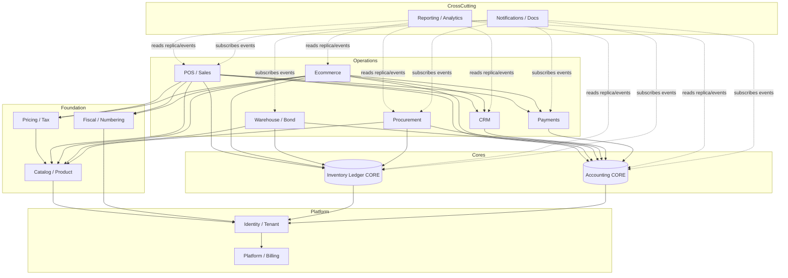
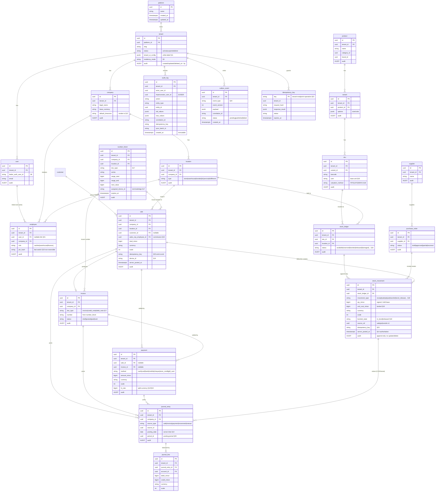
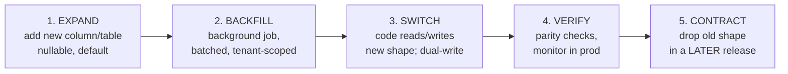

# RetailOS Domain Model

> **Status:** Design / Planning (Phase 0). No implementation code. Drizzle and Mermaid blocks below are **illustrative sketches**, not files to create. Source of truth is `docs/architecture/retailos-master-charter.md`; cited as §N inline.
>
> Companion docs: `glossary.md` (ubiquitous language), `phase-roadmap.md` (§31 sequencing), `module-specs/` (per-module detail). This document satisfies Initial Deliverables 3–6 (§30) and Final Output items 5–6 (§49).

---

## 1. Modeling Principles (the contract)

These principles bind every entity below. They come straight from the charter and are non-negotiable.

| Principle | Source | Implication for the model |
|---|---|---|
| **ERP-first: one shared domain model** | §3, §33 | POS, inventory, accounting, CRM, procurement, ecommerce, warehouse all read/write the **same** entities. No parallel inventory or customer tables per module. |
| **Inventory is ledger-based** | §18, §33 | `stock_movement` is append-only truth; on-hand is a projection, never a stored counter. |
| **Double-entry accounting from day one** | §20 | `journal_entry` + balanced `journal_line`s back every financial fact; sales/COGS/tax/landed-cost post to the ledger. |
| **Audit everything; no hard deletes** | §8, §25, §33 | Tenant-owned tables carry audit fields and `deleted_at` (soft delete). Erasure only via crypto-shredding (§25). |
| **Multi-tenant scoping everywhere** | §8, §33 | Every tenant-owned table carries `tenant_id`; shared SaaS enforces RLS on top of app guards. |
| **Money as integer minor units** | §19, §33 | Every monetary value = `amount` (bigint minor units) + `currency` (ISO 4217) + `scale` (decimals). Never floats; not every currency has 2 decimals. |
| **Event-driven via Outbox** | §24 | Major business actions emit versioned, tenant-scoped, replayable events through `outbox_event`. |
| **Idempotent + replay-safe offline** | §13, §14, §23 | `idempotency_key` guards mutations; offline payloads carry device/terminal/monotonic counter/payload version. |
| **Server time authoritative** | §14 | Device clocks untrusted; accounting/fiscal posting time set by server. |

---

## 2. Bounded Contexts / Modules (§3)

RetailOS is one domain model partitioned into bounded contexts. Each owns its aggregates but shares the two **cores** — the **Inventory Ledger** and **Accounting** — which most other contexts post into rather than duplicate.

| # | Context / Module | Aggregate roots (owns) | Reads from | Writes to (core) | Charter |
|---|---|---|---|---|---|
| 1 | **Identity / Tenant** | `platform`, `tenant`, `company`, `location`, `user`, `employee`, membership | Better Auth org/session | — | §6, §8 |
| 2 | **Catalog / Product** | `product`, `variant`, `sku`, `barcode`, category, brand, UoM, bundle/BOM | — | — | §18, §21 |
| 3 | **Inventory Ledger** *(CORE)* | `stock_ledger`, `stock_movement`, reservation, valuation layer | catalog, location | self (append-only) | §18 |
| 4 | **Warehouse / Bond** | zone/bin, pick/pack/dispatch task, stock count, import batch, bond release | catalog, inventory | inventory, accounting | §18 |
| 5 | **Procurement** | `supplier`, `purchase_order`, GRN, supplier bill, landed cost | catalog, inventory | inventory, accounting | §18 |
| 6 | **POS / Sales** | `sale`, sale line, shift, return/refund, commission | catalog, inventory, pricing/tax, fiscal | inventory, accounting, fiscal | §19 |
| 7 | **Accounting** *(CORE)* | `journal_entry`, journal line, account, AR/AP, bank, period | all postings | self | §20 |
| 8 | **CRM** | `customer`, lead, opportunity, loyalty, credit limit, store credit | sales, accounting (AR) | accounting | §21 |
| 9 | **Ecommerce** | storefront, online order, cart, fulfillment | catalog, inventory, pricing/tax | inventory, accounting, fiscal | §21 |
| 10 | **Pricing / Tax** | price list, promotion, tax rule, exemption certificate | catalog, customer group | — | §19 |
| 11 | **Fiscal / Numbering** | `number_block`, fiscal document, numbering series | sale, invoice | self | §17 |
| 12 | **Payments** | `payment`, payment method, gift card, store credit ledger, refund | sale, invoice | accounting | §19, §23 |
| 13 | **Notifications / Docs** | document, print template, notification, webhook subscription | events | — | §22 |
| 14 | **Reporting / Analytics** | read models, materialized views, insight projections | event stream (read replica) | — | §27 |
| 15 | **Platform / Billing** | subscription, license, feature flag, residency attestation, MSP ops | tenant | — | §10, §37 |

**Shared-kernel rule:** contexts 3 (Inventory Ledger) and 7 (Accounting) are shared cores. Every other context that moves stock writes a `stock_movement`; every context that touches money posts a balanced `journal_entry`. Contexts never reach into each other's aggregates directly — they call the core service or subscribe to its events (§24).

---

## 3. Module Dependency Map (§3, §24)

Arrows mean "depends on / posts into." The two cores sit at the bottom; everything funnels into them. Future modules subscribe to events rather than coupling directly (§24).



**Read this map as:** Identity/Tenant is the root everyone scopes to. Catalog + Pricing/Tax + Fiscal are the foundation Operations modules consume. POS and Ecommerce are the heaviest consumers (they touch nearly everything). Inventory Ledger and Accounting are sinks — they depend only on Identity, and everyone depends on them. Reporting and Notifications are strictly downstream/event-fed (§27 forbids heavy analytics on OLTP).

---

## 4. Core ERD (§8, §17, §18, §19, §20, §23, §24, §25)

Illustrative entity-relationship sketch of the core aggregates. Tenant-owned tables carry `tenant_id` + audit fields (`created_at`, `updated_at`, `deleted_at`, `created_by`, `updated_by`) per §8 — abbreviated here as the `«audit»` note to keep the diagram legible; the **Audit-field key** below the diagram is normative.



### Audit-field key (normative — applies to every tenant-owned table) (§8)

```
tenant_id    uuid       NOT NULL   -- scoping; RLS predicate column
created_at   timestamptz NOT NULL
updated_at   timestamptz NOT NULL
deleted_at   timestamptz NULL      -- soft delete; NO hard deletes (§33)
created_by   uuid        NULL      -- actor user/employee
updated_by   uuid        NULL
```

Append-only tables (`stock_movement`, `audit_log`, `journal_entry`/`journal_line`, `outbox_event`, sync logs) keep `created_at`/`created_by` but **never** carry `updated_at`/`deleted_at` — corrections are new compensating rows, not edits (§14, §18, §24).

---

## 5. Database Table Map (grouped by module) (§30 #5)

Ownership column: **T** = tenant-owned (carries `tenant_id` + audit + RLS); **P** = platform-owned (no `tenant_id`; lives in logically separated platform schema, §8).

### Identity / Tenant (§8)
| Table | Owner | Notes |
|---|---|---|
| `platform` | P | single row per deployment |
| `tenant` | P | references platform; **the** tenant root |
| `company` | T | per-company books/numbering |
| `location` | T | store/warehouse/bonded/etc. |
| `user` | T | mirrors Better Auth user (§6) |
| `employee` | T | linked to user, not identical (§21) |
| `membership` / `company_access` | T | company/location scope (§7) |

### Catalog / Product (§18)
| Table | Owner |
|---|---|
| `product`, `variant`, `sku`, `barcode` | T |
| `category`, `brand`, `unit_of_measure`, `uom_conversion` | T |
| `bundle`, `bom`, `bom_line` (assembly/kit) | T |

### Inventory Ledger — CORE (§18)
| Table | Owner | Notes |
|---|---|---|
| `stock_ledger` | T | per sku × location × status |
| `stock_movement` | T | append-only |
| `stock_reservation` | T | reservation/release |
| `valuation_layer` | T | FIFO/LIFO cost layers |

### Warehouse / Bond (§18)
| Table | Owner |
|---|---|
| `zone`, `aisle`, `rack`, `bin` | T |
| `pick_task`, `pack_task`, `dispatch`, `putaway` | T |
| `stock_count`, `cycle_count` | T |
| `import_batch`, `bond_release`, `customs_doc` | T |

### Procurement (§18)
| Table | Owner |
|---|---|
| `supplier`, `supplier_contact` | T |
| `purchase_request`, `purchase_order`, `po_line` | T |
| `grn`, `grn_line`, `supplier_bill`, `vendor_payment` | T |
| `landed_cost`, `landed_cost_allocation` | T |

### POS / Sales (§19)
| Table | Owner |
|---|---|
| `sale`, `sale_line`, `sale_tax_line` | T |
| `shift`, `cash_movement`, `drawer_count` | T |
| `return`, `refund`, `exchange`, `store_credit_txn` | T |
| `commission_rule`, `commission_statement`, `commission_payout` | T |

### Accounting — CORE (§20)
| Table | Owner |
|---|---|
| `account` (chart of accounts) | T |
| `journal_entry`, `journal_line` | T (append-only) |
| `posting_period`, `fiscal_year` | T |
| `bank_account`, `bank_reconciliation` | T |
| `ar_balance`, `ap_balance`, `fx_rate` | T |

### CRM (§21)
| Table | Owner |
|---|---|
| `customer`, `customer_group`, `contact` | T |
| `lead`, `opportunity`, `pipeline_stage` | T |
| `loyalty_account`, `credit_limit`, `activity` | T |

### Ecommerce (§21)
| Table | Owner | Notes |
|---|---|---|
| `storefront`, `storefront_page`, `collection` | T | shares catalog + inventory; **no** separate inventory (§21) |
| `online_order`, `cart`, `fulfillment` | T |
| `coupon`, `review`, `wishlist` | T |

### Pricing / Tax (§19)
| Table | Owner |
|---|---|
| `price_list`, `price_list_item`, `promotion`, `promotion_rule` | T |
| `tax_rule`, `tax_jurisdiction`, `tax_exemption_certificate` | T |

### Fiscal / Numbering (§17)
| Table | Owner |
|---|---|
| `numbering_series`, `number_block` | T |
| `fiscal_document`, `fiscal_submission`, `fiscal_log` | T |

### Payments (§19, §23)
| Table | Owner |
|---|---|
| `payment`, `payment_method`, `payment_terminal` | T |
| `gift_card`, `gift_card_txn`, `store_credit_ledger` | T |

### Notifications / Docs (§22)
| Table | Owner |
|---|---|
| `document`, `document_version`, `print_template` | T |
| `notification`, `notification_log` | T |
| `webhook_subscription`, `webhook_delivery` | T |

### Reporting / Analytics (§27)
| Table | Owner | Notes |
|---|---|---|
| `report_read_model_*` (materialized) | T | fed by events; replica/CQRS — never OLTP joins (§27) |
| `insight_projection`, `saved_view`, `scheduled_report` | T |

### Platform / Billing (§10, §37)
| Table | Owner |
|---|---|
| `subscription`, `plan`, `license`, `invoice_billing` | P |
| `feature_flag`, `tenant_feature_flag` | P / T |
| `residency_attestation`, `msp_action_log` | P |
| `tenant_provisioning_job` | P |

### Cross-cutting (every tenant) (§14, §23, §24, §25)
| Table | Owner | Notes |
|---|---|---|
| `audit_log` | T | immutable (§25) |
| `outbox_event` | T | versioned events (§24) |
| `idempotency_key` | T | scoped tenant+endpoint+op (§23) |
| `sync_batch`, `sync_log` | T | offline reconciliation (§13/§14) |
| `pii_vault` | T | per-subject-key encrypted; crypto-shred target (§25) |

**Platform vs tenant summary:** `platform`, `tenant`, billing/license/plan, MSP logs, residency attestations, and global feature-flag definitions are **platform-owned** (no `tenant_id`, separate schema/DB). **Everything else is tenant-owned**, scoped by `tenant_id`, audit-tracked, and (in shared SaaS) RLS-protected.

---

## 6. Drizzle Schema Plan (sketches only) (§30 #6, §33)

> These are **conventions + illustrative sketches**, not real `.ts` files. Use Drizzle (not Prisma, §33), strict TS, Zod validation.

### Conventions
- **snake_case** for tables/columns; plural-free singular table names (`sale`, not `sales`).
- **`tenant_id` on every tenant-owned table**, always first FK; RLS predicate column.
- **Money composite** everywhere: `{ *_minor: bigint, currency: char(3), scale: smallint }` — never a numeric/float column (§19, §33).
- **No hard deletes**: soft `deleted_at`; queries filter `deleted_at IS NULL`. Erasable PII lives in `pii_vault` only (§25).
- **Append-only ledgers**: `stock_movement`, `journal_entry`/`journal_line`, `audit_log`, `outbox_event` get no `UPDATE`/`DELETE` grants; corrections are new rows.
- **UUID v7** PKs (time-sortable); `created_at`/`updated_at` via DB defaults.
- **Shared reusable column groups** via helper spreads: `tenantColumns()` and `auditColumns()`.

### Reusable column helpers (sketch)
```ts
// ILLUSTRATIVE — not a file to create
const tenantColumns = () => ({
  tenantId: uuid("tenant_id").notNull(),          // RLS predicate (§8)
});

const auditColumns = () => ({
  createdAt: timestamp("created_at", { withTimezone: true }).defaultNow().notNull(),
  updatedAt: timestamp("updated_at", { withTimezone: true }).defaultNow().notNull(),
  deletedAt: timestamp("deleted_at", { withTimezone: true }),   // soft delete only
  createdBy: uuid("created_by"),
  updatedBy: uuid("updated_by"),
});

// money is a *pattern*, not a type — three columns travel together (§19)
const money = (p: string) => ({
  [`${p}Minor`]: bigint(`${p}_minor`, { mode: "bigint" }).notNull(),
  [`${p}Currency`]: char(`${p}_currency`, { length: 3 }).notNull(),
  [`${p}Scale`]: smallint(`${p}_scale`).notNull(),
});
```

### Append-only ledger (sketch)
```ts
// ILLUSTRATIVE
export const stockMovement = pgTable("stock_movement", {
  id: uuid("id").primaryKey(),
  ...tenantColumns(),
  stockLedgerId: uuid("stock_ledger_id").notNull(),
  movementType: text("movement_type").notNull(), // §18 enumerated set
  qtyMinor: bigint("qty_minor", { mode: "bigint" }).notNull(), // signed, UoM-base
  ...money("unitCost"),
  bondedState: text("bonded_state"),             // in_bond | released (§18)
  sourceType: text("source_type"),               // sale|po|transfer
  sourceId: uuid("source_id"),
  idempotencyKey: text("idempotency_key").notNull(), // §23
  serverPostedAt: timestamp("server_posted_at", { withTimezone: true }).notNull(), // §14
  createdAt: timestamp("created_at", { withTimezone: true }).defaultNow().notNull(),
  createdBy: uuid("created_by"),
  // NO updatedAt / deletedAt — append-only
}, (t) => [
  uniqueIndex("uq_movement_idem").on(t.tenantId, t.idempotencyKey),
  index("ix_movement_ledger").on(t.tenantId, t.stockLedgerId),
]);
```

### RLS hook (design intent only)
For shared-SaaS tenant tables, each gets an RLS policy `tenant_id = current_setting('app.tenant_id')::uuid`, set per-request by the Hono tenant-guard middleware (§8/§29). Drizzle issues the `SET LOCAL app.tenant_id` inside the request transaction. (Full RLS strategy is a separate deliverable, §30 #19.)

---

## 7. Migration Strategy (§8, §28)

### Expand / Contract (mandatory)
Never ship a destructive migration in the same release that begins using the new shape (§8). Every schema change runs the four-step loop:



| Step | Action | Guardrail |
|---|---|---|
| Expand | Add new columns/tables additively (nullable or defaulted) | No `NOT NULL` without default; no renames-in-place |
| Backfill | Idempotent, retryable, tenant-scoped background job (§28) | Batched to avoid lock storms |
| Switch | Dual-write old+new; reads move to new | Behind a feature flag where risky |
| Verify | Row-count/parity checks; monitor prod | Staging validation + pre-migration backup (§28) |
| Contract | Drop old column/table | Only in a **later** release after verify is clean |

### Migration Fan-Out (§8, §28, §36)
The same migration set must apply across heterogeneous targets. Order and tooling differ; the **migration files are identical**.

| Target | Topology | Fan-out mechanism |
|---|---|---|
| Multi-tenant SaaS | one shared DB | single run; RLS preserved across migration |
| Dedicated cloud | DB-per-tenant | iterate the tenant DB registry; parallel with concurrency cap |
| Managed private | DB-per-tenant (RetailOS-hosted) | same registry runner, per-instance |
| Self-hosted | customer-managed DB | shipped in release image; runs on deploy/upgrade |
| Edge Hub | Postgres or SQLite (§4/§15) | dialect-aware subset; only tables the hub mirrors; force-lock clients too far behind schema (§28) |

Fan-out runner requirements: idempotent (safe re-run), records per-target migration status (surfaced in MSP console, §10), supports rollback plan + pre-migration backup, and never assumes a single DB (§9 no hardcoded region/provider).

**SQLite/Edge caveat:** Edge Hub on SQLite cannot use every Postgres feature (no RLS, limited types). The Edge schema is a **declared subset** of the cloud schema; expand/contract still applies but the dialect-specific DDL is generated separately.

---

## 8. Mock Seed-Data Strategy (§32 local dev seeding, §38)

The Dockerized dev environment auto-seeds on first boot so contributors skip manual setup (§32). Seeding is **idempotent** (safe to re-run) and **clearly fake** (no real PII).

### What gets seeded
| Layer | Seed contents |
|---|---|
| **Platform** | One `platform` row; one **platform-admin** account (standardized creds via env, never committed, §25/§36); one sample subscription plan + feature-flag set. |
| **Sample tenant** | One `tenant` ("Acme Retail") with `tenant_ui_config` defaults (§11); one `company` (base currency GYD + USD enabled, §12); 3 `location`s (1 store, 1 warehouse, 1 bonded). |
| **Identity** | Tenant-admin, a cashier (with PIN hash for fast switch §19), a warehouse user, a finance user — exercising the RBAC boundaries (cashiers ≠ warehouse ≠ finance, §7). |
| **Catalog** | ~20 products across categories/brands, multi-UoM (carton↔unit), one batch/expiry SKU, one serialized SKU, one bundle/BOM (§18). |
| **Inventory** | Opening-balance `stock_movement`s into the store + warehouse; one **in-bond** lot in the bonded location to exercise bonded-vs-released (§18). |
| **Procurement** | One supplier + one received `purchase_order` with a landed-cost allocation (§18). |
| **Accounting** | Minimal chart of accounts + opening journal; the inventory-asset/COGS/sales/tax-payable accounts the Vertical Slice posts to (§20, §32). |
| **Fiscal** | One `numbering_series` + reserved `number_block` per doc type so offline numbering works in dev (§17). |
| **Pricing/Tax** | One VAT rule, one tax-exempt certificate, one wholesale price list (§19). |

### Rules
- Seeds align to **Vertical Slice #1** (§32) so the slice runs end-to-end immediately: Org → Company → Location → Product → Receipt → Ledger → Sale → Deduction → Invoice → Audit → Report.
- Larger/varied datasets via a factory layer (faker-style) for perf and import-wizard testing (§28) — separate from the deterministic base seed.
- Seed writes go through the same services (audit + outbox fire) so the event/audit pipeline is exercised, not bypassed.
- Demo/sandbox/training tenants for client onboarding (§38) reuse the same factory but are **not** the dev base seed.

---

## Known limitations / intentionally deferred

| # | Item | Why deferred / open question | Charter ref |
|---|---|---|---|
| 1 | **Full RLS policy DDL** | RLS strategy is its own deliverable; this doc only flags the predicate column and middleware hook. | §8, §30 #19 |
| 2 | **Edge Hub SQLite schema divergence** | The exact declared subset (which tables mirror, type mapping, no-RLS handling) is a separate Edge Hub deliverable. | §15, §30 #29 |
| 3 | **Offline queue / cached_* tables** | The `offline_*_queue` and `cached_*` structures (§13) are client-side (Dexie/SQLite) form-factor stores, modeled in the offline-sync deliverable — not the server ERD here. | §13, §4 |
| 4 | **PII vault internals** | Per-subject key schema, envelope encryption layout, and crypto-shred mechanics are sketched only (single `pii_vault` row); full design in the secrets/compliance deliverable. | §25 |
| 5 | **Valuation engine detail** | FIFO/LIFO cost-layer consumption order and weighted-avg recompute rules named but not modeled to row level. | §18 |
| 6 | **Reporting read models** | Concrete materialized-view / star-schema shapes deferred to the analytics deliverable; only the boundary (event-fed, replica, never OLTP) is fixed here. | §27, §30 #41 |
| 7 | **Fiscal document polymorphism** | Whether fiscal docs are one table with `doc_type` or per-type tables (and the GRA-specific fields) awaits GRA requirement confirmation. | §17 |
| 8 | **Billing entity placement** | Billing/license tables marked platform-owned, but per-tenant billing data (usage counters) may need a tenant-scoped projection; resolved in the SaaS-billing deliverable. | §10, §30 #21 |

---

## Summary

1. RetailOS is **one shared domain model** (§3) split into 15 bounded contexts, with **Inventory Ledger** and **Accounting** as shared cores that every other module posts into rather than duplicates.
2. The dependency map funnels Identity → Catalog/Pricing/Fiscal foundation → Operations (POS, Ecommerce heaviest) → the two cores; Reporting and Notifications are strictly downstream/event-fed (§24, §27).
3. The core ERD covers platform/tenant/company/location/user/employee, product/variant/sku, the append-only stock ledger + movements (bonded vs released), procurement, sale/payment/invoice, double-entry journals, and the cross-cutting `audit_log`/`outbox_event`/`idempotency_key`/`number_block` — with `tenant_id` + audit fields on every tenant-owned table (§8).
4. Tables are mapped per module with explicit **platform-owned vs tenant-owned** ownership; the Drizzle plan fixes conventions (snake_case, `tenant_id` everywhere, money as minor-units triplet, no hard deletes, append-only ledgers).
5. Migrations use **expand → backfill → switch → verify → contract-later**, fanned out across SaaS/dedicated/managed/self-hosted/Edge-Hub targets from identical migration files (§8, §28).
6. Seed strategy auto-provisions a platform-admin + one sample tenant aligned to Vertical Slice #1 so the dev environment runs end-to-end on first boot (§32, §38).
