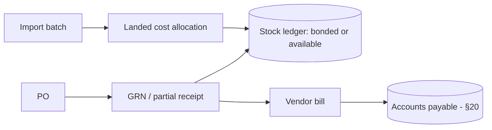

# RetailOS Money, Fiscal, and Inventory Architecture

**Planning document.** Design and decisions only — no implementation code. Illustrative tables, pseudocode, and Mermaid are used to make intent concrete. Cited sections refer to `retailos-master-charter.md` (the source of truth).

Scope: money rules (§19/§33), pricing and the tax engine plus gift cards/store credit (§19), fiscalization and document-number integrity (§17), ledger-based inventory / valuation / procurement / OCR seam (§18), and POS scope including shifts, reports, payments, commission, and fast cashier switching (§19).

---

## 1. Money Rules (§19/§33)

Money is the spine of correctness. The rules are non-negotiable engineering rules (§33):

- **Integer minor units only.** Store and compute every monetary value as integer smallest currency units. **Never floats.** No float ever touches a money value — not in storage, not in arithmetic.
- **Store the triple together: `{ amount, currency, scale }`.** Amount (integer minor units) + ISO currency code + minor-unit **scale** travel as one value. Scale is explicit, not inferred.
- **No 2-decimal assumption.** Do not assume every currency has two decimals (some have 0, 3, or other). Scale is per-currency data, never a hardcoded `* 100`.
- **One rounding policy, applied consistently.** A single, documented rounding policy (e.g. half-even) governs all conversions, tax, and allocations. No per-site ad-hoc rounding.
- **FX produces realized/unrealized gain-loss.** Currency conversion must emit **realized** (on settlement) and **unrealized** (on revaluation) gain/loss entries into accounting (§20) where applicable.

```
Money := { amount: bigint (minor units), currency: 'USD'|'GYD'|..., scale: int }
# GYD scale 2 -> 1500 means 15.00 GYD
# A 0-decimal currency has scale 0; arithmetic respects scale, never assumes 2.
# Rendering applies tenant/locale formatting; arithmetic stays integer.
```

This supports Caribbean multi-currency drawers, USD/GYD, split-currency payments, and exchange-rate tracking (§12) without float drift.

---

## 2. Pricing, Tax, and Liabilities (§19)

### Pricing engine

Supports: **price lists**, **customer-group pricing**, **wholesale tiers**, **time-bound promotions**, volume/tiered pricing, **BOGO**, mix-and-match, permissioned override, and **promotion precedence**. Tax-inclusive and tax-exclusive pricing are handled **centrally** (a price knows whether it includes tax).

**Precedence** is the load-bearing design decision: when multiple rules apply to one line, a deterministic order resolves the effective price. Illustrative precedence (to be confirmed per competitive analysis, §41):

```
effective_price(line):
  1. start from base / price-list price for the customer's group/tier
  2. apply wholesale-tier price if the customer/quantity qualifies
  3. apply the single highest-priority active promotion (BOGO / mix-and-match / volume)
     - promotions do NOT silently stack; precedence picks one unless explicitly stackable
  4. apply permissioned manual override (audited, §22) last
  5. resolve tax-inclusive vs tax-exclusive centrally before tax is computed
```

### Tax engine

Multi-jurisdiction and far beyond a flat percentage. Supports:

- **VAT / GST**.
- **Compound / stacked taxes and tax-on-tax** (one tax computed on a base that already includes another).
- **Withholding** and **reverse charge**.
- **Tax-exempt certificates** (exempt customers).
- **Multi-jurisdiction rates** (a tenant may operate stores in multiple countries, §12).
- **Line-item tax** (tax resolved per line, not just on the total).
- **Consistent tax rounding** under the single rounding policy (§1).

The engine sits behind an interface (consistent with the provider-seam pattern) so jurisdictions are **data-driven, not hardcoded to Guyana** (§17/§12).

### Gift cards and store credit (liabilities)

Gift cards and store credit are **liabilities, not revenue on issue**. Revenue is recognized **on redemption** (§20). Include **fraud controls, balance audit, expiry rules where legally allowed, and redemption history**. This is an accounting correctness rule, not a POS convenience.

---

## 3. Fiscalization and Document-Number Integrity (§17)

### Pluggable fiscal provider seam

Reserve a **pluggable fiscalization seam from day one**. Behind one provider interface (consistent with tax/payment/OCR seams): country-specific fiscal providers, **fiscal receipt signing**, fiscal device/printer integration, **tax-authority submission/clearance**, e-invoice status tracking, **credit-note fiscal documents**, cancellation/void fiscal rules, and **fiscal logs**. Confirm Guyana GRA requirements before launch; **do not hardcode one country's fiscal rules**.

### Gapless, tamper-evident document numbering

Receipts, invoices, **credit notes**, debit notes, purchase documents, and journal entries require **sequential tamper-evident numbering**, scoped per:

```
(company, location, fiscal_year, document_type, numbering_series)
```

Each scope is its own **gapless** sequence. The system must **track gaps, voids, out-of-sequence documents, unused reserved numbers, and expired number blocks** (§17), and emits `document.number_gap_detected` (§24) plus a numbering-gap alert (§22) when a break is found. A **Document number checker** helper tool (§26) audits sequences.

### Offline number-block reservation — never two terminals mint the same number

```mermaid
sequenceDiagram
  participant Cloud as Cloud / Edge Hub (issuer)
  participant T1 as Terminal 1
  participant T2 as Terminal 2
  Cloud->>T1: reserve block [1001..1100] for (company,loc,FY,doctype,series)
  Cloud->>T2: reserve block [1101..1200] (disjoint)
  Note over T1,T2: offline — each mints ONLY from its own block
  T1->>T1: invoice 1001, 1002, ...
  T2->>T2: invoice 1101, 1102, ...
  T1-->>Cloud: on sync, reconcile used/unused; flag gaps
```

Offline terminals mint **only from number blocks issued by the cloud or Edge Hub** (`cached_number_blocks`, §13). Blocks are **disjoint by construction**, so **two terminals can never mint the same number**. On sync, used/unused numbers reconcile and gaps/expired blocks are flagged. The Edge Hub maintains local number blocks and issues per-terminal sub-blocks during LAN-offline operation (§15).

### Credit note as a first-class document

A **credit note is a first-class fiscal document type, not merely a refund flag** (§17). It gets its own document type, its own numbering series, and its own fiscal treatment (signing/clearance) where the jurisdiction requires it.

---

## 4. Ledger-Based Inventory (§18)

**Inventory is ledger-based, never simple counters** (§33: *every inventory movement must create a ledger entry*). Stock-on-hand is **derived from the append-only stock ledger**, which is the source of truth and reconciles with offline conflict resolution (§14).

### Inventory states

`available`, `reserved`, `damaged`, `lost`, `in transit`, `bonded`, `released`, `returned`, `quarantined`, `expired`.

### Movement types

`opening balance`, `purchase receipt`, `sale`, `return`, `refund`, `adjustment`, `transfer out/in`, `damage`, `loss`, `expiry`, `bond release`, `assembly build/disassembly`, `reservation`, `reservation release`. Every one is a ledger entry; stock-on-hand is the running projection.

### Valuation

**FIFO, LIFO, weighted average (WAVG)** — selectable; valuation is computed from the ledger, not stored as a mutable field.

### Vertical-specific tracking

| Vertical | Requirement |
|---|---|
| Pharmacy / supermarket | **FEFO** picking (first-expiry-first-out), **batch/expiry** tracking, expiry alerts |
| Wholesale / distribution | **Multi-UoM** conversions (buy cartons, stock units, sell cartons or units) |
| Supermarket | Weight/price embedded barcode parsing + scale integration |
| Electronics | **Serial** capture at receiving, sale, warranty, RMA |

So: **multi-UoM, serial/batch/lot/expiry** are first-class dimensions on movements, not afterthoughts.

### Bonded vs released, and landed cost

- **Bonded and released inventory are separate** (§18). Bonded = duty-unpaid, in-bond; released = duty-paid/cleared. They are tracked as distinct states and must not be commingled.
- **Landed cost** = unit cost including freight, duty, insurance, allocated across receipt lines (glossary). Bonded flow: import batches → supplier invoices → customs references → freight/insurance → duty/VAT estimates → **landed cost** → duty clearance workflow → **bond release approval** (§22) → bond-to-store transfer → released stock posting.

### Procurement

Suppliers and contacts → purchase requests/orders → **approvals** (§22) → **GRNs with partial receiving** → **supplier (vendor) bills** → vendor credits/payments → **landed costs** → **import batches** / container/freight/customs tracking → bond receiving → purchase history → supplier performance → reorder suggestions.



### OCR / LLM document-parsing provider seam

Reserve a **pluggable seam** for intelligent document processing: OCR + LLM parsing of **supplier invoices, GRNs, POs, and customs documents** to auto-populate line items, quantities, and costs. Implemented **behind a provider interface** (consistent with fiscal/tax/payment seams), **tenant-scoped**, with **mandatory human review and confirmation before posting**, and **full audit of AI-extracted vs user-corrected values** (§18/§25). AI never posts unattended.

---

## 5. POS Scope (§19)

POS is the highest-frequency, speed-critical surface (motion budget near-zero, §5; checkout p95/search/scan budgets, §44). Scope relevant to this plan:

### Shifts, reports, and blind close

- **Shifts**: open/close, cash reconciliation, **fast cashier switching** (below).
- **X-Reports**: mid-shift snapshots, per terminal and shift.
- **Z-Reports**: end-of-day final settlement, per terminal and shift.
- **Blind shift close**: the cashier enters the **physically counted** drawer cash **without the system showing the expected amount**; the system computes **over/short** for the manager's audit log (shrinkage control), tied to approval + audit trail (§22/§25).

### Payments

Methods: **cash, card, bank transfer, mobile money, cheque, store credit, gift card, mixed payments**. **Split payments and multi-currency payments** are first-class (multi-currency drawers, §12). Each payment leg carries its own `{amount, currency, scale}` (§1); FX legs produce gain/loss (§1/§20). EFTPOS Standalone vs Integrated distinction is handled at the hardware bridge (§16; see offline-edge-hardware.md).

### Commission / sales rep

The cashier **selects a Sales Representative at checkout**. The commission engine supports **flat, percentage, product-level, category-level, sales-rep-level, tiered** commission, plus reports, statements, payouts, and **refund/void adjustments** (a refund or void must claw back the related commission).

### Fast cashier switching (PIN / badge / biometric over device trust)

Rapid register switching and time-clock punching via **4-digit PIN, RFID/NFC badge, or biometric scanner** — so a cashier stepping away does **not** require full email/password/2FA re-entry.

- This is **fast local re-authentication layered on an already device-authorized terminal**: the terminal holds **device trust** (Better Auth device authorization, §6); the PIN/badge/biometric only **resolves the cashier identity** for the shift.
- Every switch, override, void, and punch is **fully audit-logged to the resolved user** (§25).
- Verification must **work offline** within the **device-token grace window** (§13/§14; see offline-edge-hardware.md) against the offline entitlement snapshot.
- **Biometrics = non-reversible templates only.** Store **only non-reversible templates or hashes, never raw biometrics**, governed by the PII and crypto-shredding policy (§25); **never sync raw biometric data to the cloud** (§19).

```
authenticate_cashier(terminal):
  require terminal.device_trust == valid            # Better Auth device authz (§6)
  factor := PIN | badge | biometric_template_match  # non-reversible compare only
  user := resolve_identity(factor)                   # against offline snapshot (§13)
  audit.log(actor=user, terminal, event='cashier_switch')  # always, even offline
  return shift_session(user)
```

---

## Known limitations / intentionally deferred

- **Rounding policy is named but not fixed.** The charter mandates *one* policy consistently applied (§19/§33); the exact mode (e.g. half-even vs half-up) and per-jurisdiction tax-rounding nuances are confirmed during the accounting/tax build (§20) and competitive analysis (§41), not here.
- **Promotion precedence and stacking rules are illustrative.** The precedence ladder in §2 is a design sketch; exact stackability, coupon interaction, and tie-breaks are finalized in the POS/pricing module spec after competitive analysis (§41/§42).
- **Fiscalization is a seam, not an implementation.** Guyana GRA specifics and any other jurisdiction's signing/clearance flows are unverified and deferred (§17); only the provider interface and numbering integrity are designed now.
- **OCR/LLM procurement parsing is a seam, not a provider choice.** No model/vendor is selected; human-review-before-post and full extract-vs-corrected audit are the firm constraints (§18).
- **Valuation method per tenant/location is configurable but interactions deferred.** FIFO/LIFO/WAVG selection is designed; revaluation, multi-currency cost-layer interaction, and accounting postings for COGS/inventory-asset land in the accounting foundation (Phase 5, §31).
- **Bonded/customs workflow is country-sensitive.** Duty/VAT estimate formulas and customs document formats are not hardcoded and require local rules per jurisdiction (§12/§18).
- **Commission payout mechanics are out of scope here.** The engine's rules and adjustment triggers are designed; actual payroll/payout integration (HR §21) is deferred.
- **Phase ordering.** Per §31, money/gift-card liabilities and accounting placeholders are **Phase 5**, procurement **Phase 6**, while POS + offline queue + number-block reservation are **Phase 4**; fiscalization implementation is later still. This document plans across those phases but does not pull them forward.
- **Biometric template storage details** (which algorithm, where templates live, key handling) defer to the PII vault / crypto-shredding design (§25); this document only fixes the non-reversible-only and never-sync-raw constraints.
