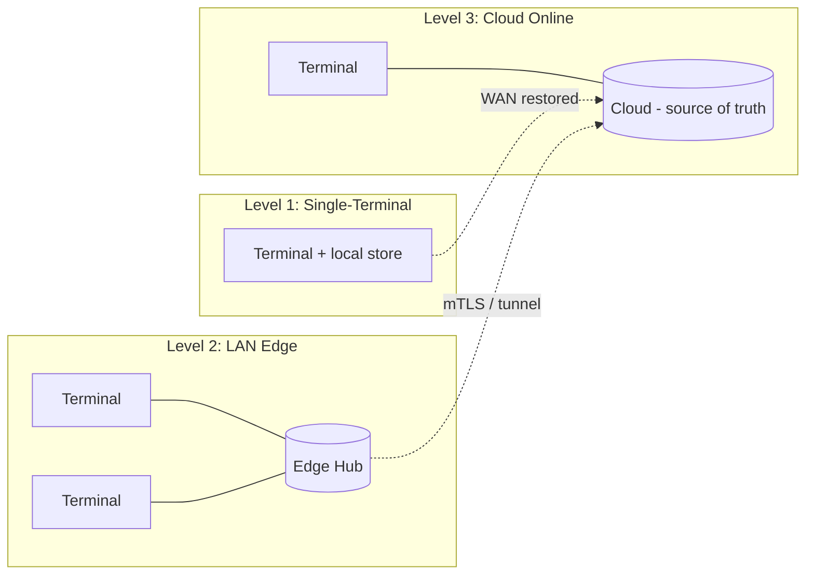
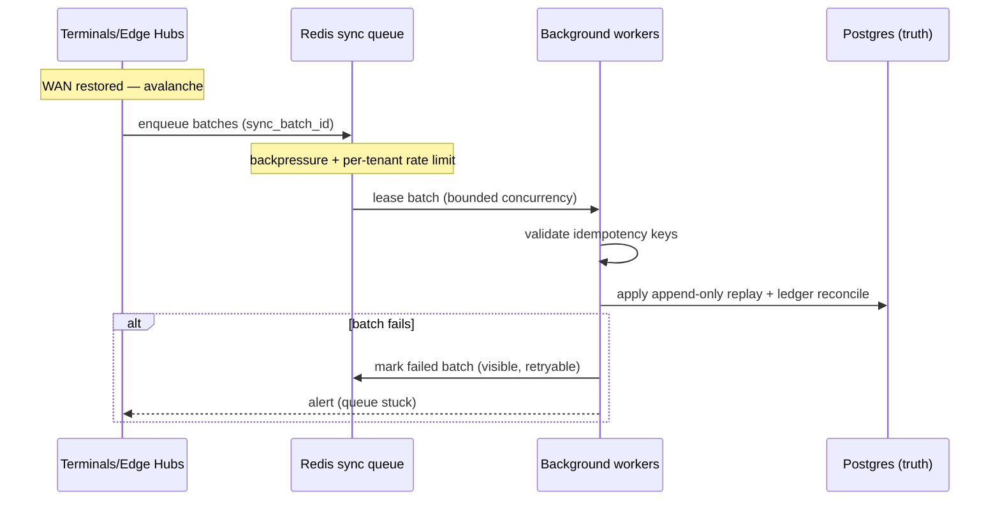
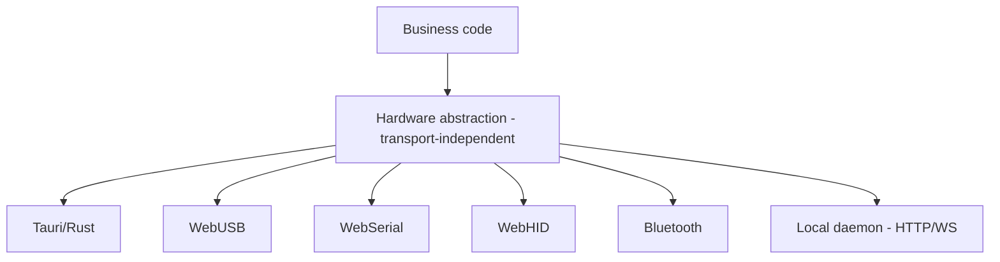

# RetailOS Offline, Edge, and Hardware Architecture

**Planning document.** Design and decisions only — no implementation code. Illustrative tables, pseudocode, and Mermaid are used to make intent concrete. Cited sections refer to `retailos-master-charter.md` (the source of truth).

Scope: offline levels (§13), the per-form-factor offline store engine (§4), local offline structures and reconnect behavior (§13), offline conflict and time integrity (§14), reconnection-avalanche mitigation (§14), the Edge Hub (§15) and its zero-trust networking (§29), and the hardware bridge (§16) including EFTPOS modes (§19).

---

## 1. Three Offline Levels (§13)

RetailOS does not have a single "offline mode." It has three operating levels, chosen by what connectivity remains. The cloud is always the authoritative source of truth (§3); local storage and the Edge Hub are continuity layers, never the truth.

| Level | Condition | What still works | Coordination authority | Number minting (§17) |
|---|---|---|---|---|
| **1. Single-Terminal Offline** | One terminal loses internet; no LAN peer | That terminal: reads from local cache, queues sales/payments/refunds, prints receipts locally | The terminal itself (isolated) | From the terminal's own reserved **number block** |
| **2. LAN Edge Offline** | Store WAN down, LAN up; ≥1 terminal + Edge Hub | All terminals on the LAN: shared stock reservation, shared shift state, dedup of sales | The **Edge Hub** (LAN authority) | Edge Hub issues sub-blocks per terminal |
| **3. Cloud Online** | Normal connectivity | Everything; live WebSocket events, dashboards, sync | The **cloud** (source of truth) | Cloud issues number blocks |

Key rule: a level is a **degradation path, not a deployment choice**. The same terminal moves Level 3 → Level 1 (or → Level 2 if an Edge Hub is present) when the WAN drops, and back up on reconnect. The Edge Hub is **optional** (§15); small businesses operate with only Levels 1 and 3.

### Offline store engine per form factor (§4) — do NOT assume IndexedDB everywhere

The offline store is the form factor's native, durable engine — not a one-size-fits-all assumption:

| Form factor | Offline store engine | Notes |
|---|---|---|
| **Web app** (TanStack Start) | **Dexie.js + IndexedDB** + TanStack Query persistence | Browser sandbox; suited to back-office/storefront and light POS |
| **Tauri desktop POS / warehouse** | **Embedded SQLite** | Sized for supermarket-scale catalogs and large offline datasets; static/SPA build, must not assume the SSR server is reachable |
| **Native mobile** (Expo / RN) | **SQLite via Expo SQLite or op-sqlite** | Mobile POS, scanning, stock counts |
| **Edge Hub** | **PostgreSQL** (larger sites) or **SQLite** (smaller sites) | Server-class store for LAN coordination |

Charter §4 is explicit: *"Do not assume IndexedDB everywhere."* Business code talks to an **offline store interface** (a repository/queue abstraction); the concrete engine is selected per form factor so the same sync/queue logic runs on Dexie, SQLite, or Postgres without branching on the storage layer.

---

## 2. Local Offline Structures (§13)

Two kinds of local state: **append-only queues** (mutations awaiting sync) and **read caches** (data needed to operate disconnected).

**Offline queues (mutations):**
`offline_sales_queue`, `offline_inventory_queue`, `offline_transfer_queue`, `offline_payment_queue`, `offline_refund_queue`, `pending_sync_logs`.

**Read caches:**
`cached_products`, `cached_prices`, `cached_customers`, `cached_tax_rules`, `cached_sales_reps`, `cached_location_settings`, `cached_payment_methods`, `cached_receipt_templates`, `cached_entitlements`, `cached_permissions`, `cached_feature_flags`, `cached_number_blocks`.

Design notes:
- Queues are **append-only** and ordered by a local monotonic counter (§14). Entries are never edited in place; status transitions (`pending → syncing → confirmed | failed`) are tracked separately.
- Caches are **refreshed while online** and have a freshness/TTL; a terminal that has been offline beyond its grace window (below) must refresh entitlements/permissions/feature flags before it is trusted again.
- `cached_number_blocks` holds the reserved document-number ranges (§17) the terminal may mint from offline — never a shared global counter.
- Per the UI guardrail (§5): never use `localStorage`/`sessionStorage` for app state; use the form-factor offline store engine.

### Offline behavior (§13)

- Reads come from local cache.
- Sales / payments / refunds **queue locally** (append-only).
- Local stock is deducted/reserved per the chosen **oversell policy** (§14, below).
- Receipts generate locally from `cached_receipt_templates`.
- End-of-day shows **local totals and last-synced totals** side by side.
- The **offline entitlement snapshot** controls which features are allowed offline.
- **Device-token grace** controls how long the terminal may keep operating disconnected.

### Reconnect behavior (§13)

On reconnect, the terminal/Edge Hub must:
1. Sync **sequentially with idempotency keys** (§23).
2. **Resolve server timestamps** (server time is authoritative for accounting/fiscal, §14).
3. **Detect conflicts** and reconcile local vs server state (ledger truth dominates, §14).
4. **Clear successful** queue entries; **keep failed entries visible** for retry tools.
5. **Upcast older payload versions** (schema may have moved on).
6. **Never silently discard** an offline transaction (§33).

### Offline entitlement snapshot + device-token grace

- The **offline entitlement snapshot** (`cached_entitlements` / `cached_permissions` / `cached_feature_flags`) is the resolved entitlement set (§7) captured while online: what the terminal and its cashiers may do without a live check. Fast cashier switching (PIN/badge/biometric, §19) resolves identity against this snapshot offline.
- **Device-token grace** is a bounded validity window on the device authorization (Better Auth device authorization, §6). The terminal may operate offline within the grace window; once exceeded, it is **force-locked** until it reconnects and re-validates (ties to client auto-update force-lock, §28). This bounds risk from lost/stolen terminals and stale entitlements.

---

## 3. Offline Conflict and Time Integrity (§14)

The central distinction: **append-only events** vs **mutable shared state**. They are reconciled differently and must never be collapsed into one strategy.

### Append-only events — replay by idempotency key

Sales, payments, stock-ledger entries, audit logs, and sync logs are **append-only**. They must **not conflict by overwrite**; on sync they are **replayed in order, keyed by idempotency key** (§23), so the server applies each effect **exactly once** even across duplicate/retried delivery. A replayed event already seen is a no-op.

### Mutable shared state — never blind last-write-wins

Stock-on-hand, price, customer balance, tax settings, and entitlements are **mutable shared state**. They must **never** use last-write-wins blindly. Instead:

- **Ledger truth and reconciliation dominate.** Stock-on-hand is *derived from the ledger*, not a field two clients race to overwrite. Two offline terminals that each "sell the last unit" both produce valid ledger movements; the server reconciles them via the oversell policy rather than letting one overwrite the other.
- Balances and settings reconcile against authoritative server state, surfacing conflicts for human resolution where they cannot be merged deterministically.

### The three per-tenant/location oversell policies (§14)

Chosen per tenant/location:

| # | Policy | Behavior | Trade-off |
|---|---|---|---|
| 1 | **Allow oversell with flagged backorder** | Sale proceeds offline; oversell flagged, backorder created on sync | Max availability; risk of unfulfillable promises |
| 2 | **Hard local reservation via Edge Hub** | Edge Hub holds a real LAN reservation; no terminal sells stock it cannot reserve | Strongest correctness; requires an Edge Hub (Level 2) |
| 3 | **Optimistic deduction + compensating correction** | Deduct locally; on sync conflict, post a compensating ledger correction | Balanced; needs visible corrections + manager alerts |

Whatever policy is chosen: the **stock ledger must reconcile**, conflicts must be **visible**, **managers alerted**, and **no movement lost or duplicated** (§14).

### Untrusted device clocks

Offline device clocks are **untrusted**. Every offline mutation carries:

| Field | Purpose |
|---|---|
| `device_id` | Which physical device |
| `terminal_id` | Which logical terminal/register |
| `monotonic_counter` | Per-device strictly increasing sequence; orders events independent of wall clock |
| `local_ts` | Device-local timestamp — **informational only**, never authoritative |
| `payload_version` | Schema version for upcasting (§13) |
| `idempotency_key` | Exactly-once replay key (§23) |

**Server time is authoritative** for accounting periods, fiscal postings, and official posting time (§14/§33). `local_ts` is recorded for forensics and ordering hints but never decides which accounting period or fiscal sequence a document lands in.

---

## 4. Reconnection Avalanche Mitigation (§14)

When many terminals (and Edge Hubs) reconnect at once after a WAN outage, naive sync causes database lock storms and API timeouts. Mitigation:

- **Redis queues** absorb the surge between ingest and processing.
- **Backpressure and rate limits** — tenant-aware token-bucket keyed by `tenant_id` (§8) so one recovering tenant cannot starve others.
- **Batch sync events** into a `sync_batch_id`; process batches safely rather than per-event hammering.
- **Validate idempotency keys** on every event so retried batches are no-ops.
- **Track queue depth and failed sync batches**; surface to observability (§26).
- **Retry tools and alerts** — failed batches are visible and replayable; managers alerted on stuck queues (§22 `edge_hub.queue_stuck`).

These map to the charter's required resilience tests (§26): reconnection-avalanche load, N terminals + M Edge Hubs reconnecting, network killed mid-sync, corrupt/duplicate queued mutation, offline session expiry, payload-version upcast.

---

## 5. Edge Hub (§15)

The Edge Hub is an **optional** Dockerized LAN sync hub for supermarkets, high-volume / multi-register retail, warehouses, and unreliable-WAN / stable-LAN sites. **Cloud remains source of truth**; small businesses must operate without it (Levels 1 + 3 only).

**Deployability:** mini PC, local server, back-office workstation, NAS, Docker host, or Proxmox VM/LXC.

**Responsibilities:**
- Accept POS transactions over the LAN.
- Maintain a local transaction queue.
- Coordinate **local stock reservations** (enables oversell policy #2).
- Prevent duplicate local sales where possible.
- Maintain **local cashier shift state**.
- Maintain **local receipt/document number blocks** (issues per-terminal sub-blocks, §17).
- Sync upstream to cloud and **resolve cloud conflicts**.
- Show local health; export unsynced transactions; log sync activity.
- Support device registration and terminal authorization.
- Support local backup of unsynced transactions.

### Local disaster recovery (§15)

Beyond upstream cloud sync, the Edge Hub runs **continuous automated local backups** of its Postgres/SQLite state to a **separate physical medium** — a mounted USB drive, a LAN-attached NAS, or a back-office PC — so an extended internet outage **followed by hardware loss** does not permanently destroy offline transactions that never reached the cloud. This complements (does not replace) cloud DR (§28). Export-of-unsynced-transactions is the manual escape hatch when automated paths fail.

### Zero-trust edge networking (§29)

Edge Hub ↔ cloud communication is **never plaintext** over LAN or WAN. It uses **mTLS or an encrypted tunnel** (e.g. Cloudflare Tunnel or WireGuard) with **mutual authentication** and **certificate rotation**. Secrets/certs follow the envelope-encryption and master-key policy (§25). This complements the Edge Hub design (§15) and bounds the trust placed in any single on-site box.

---

## 6. Hardware Bridge (§16)

The hardware bridge gives business code a **transport-independent abstraction**: domain code asks to "open the cash drawer" or "print this receipt" and does not care whether the device is reached via Tauri, a browser API, or a daemon. Tauri desktop is **preferred** because it reaches native hardware through Rust/plugin APIs without browser sandbox limits.

**Transports (behind one abstraction):**

| Transport | When used |
|---|---|
| **Tauri native plugins / Rust bridge** | Preferred on desktop POS/warehouse stations |
| **WebUSB** | Browser-based USB devices |
| **WebSerial** | Serial devices (some printers, scales, pole displays) |
| **WebHID** | HID-class devices |
| **Bluetooth** | Where appropriate |
| **Local hardware daemon** | When browser APIs are insufficient — Windows service, macOS helper, Linux daemon, or local HTTP/WebSocket service |

**Supported device list (§16):** ESC/POS printers, cash drawers, barcode scanners, label printers, pole displays, scales, kitchen printers, customer displays.

**Security (§16):**
- **Bind to localhost or trusted LAN only.**
- Require **pairing/token authorization**; reject unauthorized origins.
- Support **unpair/revoke**.
- **Log all hardware actions** (hardware-bridge structured log, §25).

Diagnostics ride on this seam: hardware test print, cash-drawer test, barcode/scale tests (§26).

### EFTPOS: Standalone vs Integrated (§19)

Card payment terminals are first-class and explicitly two modes, to eliminate double-entry cashier errors:

| Mode | Behavior | Money trust |
|---|---|---|
| **Standalone** | The card is run on a separate terminal; RetailOS **only records that a card was used** for the amount | Cashier-entered amount; reconciliation against settlement |
| **Integrated** | The POS **pushes the exact amount** to the terminal over local IP or a provider API (e.g. Stripe Terminal) | Amount is system-authoritative; no re-keying |

Integrated terminals reached over local IP ride the same localhost/LAN-binding + pairing/token discipline as other hardware (§16). Card data is never stored raw — only compliant tokenized provider flows (§29).

---

## Known limitations / intentionally deferred

- **No conflict-free auto-merge for mutable state.** Balances/settings that cannot merge deterministically surface for **human resolution**; RetailOS deliberately does not attempt CRDT-style automatic merge of financial/inventory state — ledger truth + reconciliation is the chosen model (§14).
- **Oversell policy is a per-tenant/location configuration, not adaptive.** The three policies (§14) are selected, not learned; there is no automatic switching based on stock confidence in this plan.
- **Edge Hub is optional and out of scope for early phases.** Per the roadmap it is **Phase 10** (§31); Levels 1 and 3 ship first. Hard local reservation (policy #2) is unavailable until an Edge Hub is deployed.
- **Hardware transport coverage is incremental.** The abstraction is defined now; concrete drivers (Tauri/WebUSB/WebSerial/WebHID/Bluetooth/daemon) land per device class in **Phase 9** (§31). Not every device class is guaranteed on every transport at launch.
- **EFTPOS provider integrations (e.g. Stripe Terminal) are seams, not built.** Integrated-mode wiring to specific providers is deferred behind the payment/hardware interface; only Standalone is assumed universally available initially.
- **Distributed client auto-update and forced schema lock** (§28) are referenced as the enforcement for device-token grace expiry but their full OTA mechanics (Tauri updater, EAS Update, Edge Hub image pulls) are specified in the deployment/CI plan, not here.
- **Biometric/PIN/badge offline auth** depends on the offline entitlement snapshot and device-token grace defined here, but template storage, the non-reversible-template requirement, and crypto-shredding are governed by the money/fiscal/POS and security/PII plans (§19/§25), not this document.
- **Exact grace-window durations, batch sizes, rate-limit buckets, backup cadences, and cert-rotation intervals are unset.** They are tuning parameters to be fixed with real-device and load-test data (§44/§26), not in this design.
