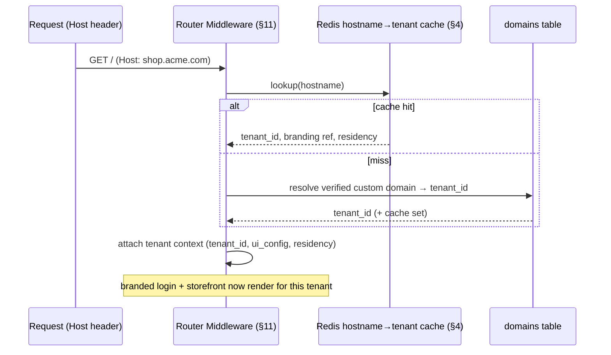
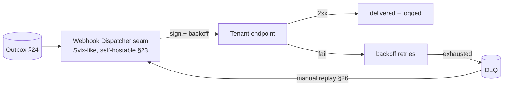

# Platform, SaaS, White-Label & Integrations Architecture

- **Status:** Planning (design only — no implementation code)
- **Date:** 2026-06-21
- **Charter refs:** §10, §11, §23, §24, §37 (with §6, §7, §9, §13, §25, §29)
- **Scope:** White-label (§11), SaaS billing + licensing (§10/§37), feature flags + platform/MSP mode (§10), integrations/webhooks/idempotency (§23), domain events + outbox (§24).

> Design/planning document. Tables, Mermaid, and pseudocode are illustrative — not implementation. Provider seams (billing, webhook dispatch) follow the pluggable-interface pattern locked in ADR 0003; this doc shows how they compose across all four deployment modes (§9).

---

## 1. White-label (§11)

### 1.1 Custom domains — hostname → tenant_id resolution

The Hono/TanStack Start router resolves `tenant_id` from the request hostname before any business logic or auth UI renders (§11). This is the entry point for branding, residency, and entitlement context.



- **Domain model:** `domains(hostname, tenant_id, verified, primary, type[app|storefront], created_at)`. Verification via the Custom Domain wizard (§5) with the domain-verification helper (§26). `custom_domain_enabled` flag gates it (§10).
- **Unverified/unknown hostname** falls back to the platform default domain (never leaks another tenant's branding).
- TLS/cert handling and the residency attestation for the domain ride along the tenant context (§9).

### 1.2 `tenant_ui_config` JSONB

Single source of branding truth (§11). All theme values are CSS custom properties (Tailwind v4, OKLCH/HSL); components read tokens — nothing hardcodes color/radius/font (§5 white-label contract).

```jsonc
// illustrative shape — not a schema
{
  "colors": { "primary": "oklch(...)", "secondary": "...", "accent": "..." },
  "radius": { "border_radius": "0.5rem", "button_radius": "...", "card_radius": "..." },
  "fonts": { "sans": "Geist", "mono": "JetBrains Mono" },
  "logos": { "app_logo": "s3://...", "favicon": "...", "receipt_logo": "...", "invoice_logo": "..." },
  "themes": { "storefront_theme": "...", "dashboard_theme": "...", "mode_preference": "system" },
  "density": { "layout_density": "comfortable", "table_density": "compact" },
  "a11y": { "contrast_mode": "normal", "accessibility_flags": [] }
}
```

### 1.3 Branded surfaces

- **Branded login** — Better Auth login renders tenant branding resolved from hostname (§11/§6).
- **Receipt / invoice / email templates** — per-tenant, WYSIWYG/HTML builder (§22); thermal receipts, PDF invoices, fiscal docs read tenant logos/footer/tax-ID/terms.
- **Storefront themes & dashboards** — tenant-themed (§5 ecommerce/dashboard surface map).

### 1.4 Contrast guardrails

Tenant themes must respect accessibility contrast (§11). Theme tokens are validated for WCAG AA contrast (shadcn studio Contrast Checker / tweakcn) **before a tenant theme is saved** (§5), and Playwright visual-regression snapshots key surfaces per theme so token changes can't push controls off-screen or break contrast (§4 VRT). A failing contrast check blocks save.

---

## 2. SaaS billing + licensing (§10/§37)

### 2.1 Commercial models

| Model (§10) | Billing nature | License state machine |
| --- | --- | --- |
| Monthly subscription | recurring | active ⇄ past_due ⇄ suspended |
| Annual subscription | recurring | active ⇄ suspended |
| Usage-based | metered | active (usage-gated, §3) |
| Perpetual license | one-time + cert (§37) | active (version-bound) |
| Annual maintenance/support | recurring add-on | supported / lapsed |
| Enterprise contract | negotiated | active (contract terms) |
| Trial | time-boxed | trial → converted / expired |
| Suspended | n/a | suspended (read-only/locked) |

### 2.2 Billing provider seam

Billing is a **provider interface** (consistent with ADR 0003 §8), never coupled to domain code:

- Providers: **Stripe / Paddle / LemonSqueezy / Polar / Chargebee** (+ future) (§10/§23). Better Auth billing plugins evaluated where useful (§6/§10), but enforcement is not Better Auth's job.
- Provider adapters normalize to internal events (`subscription.activated/updated/canceled`, `payment.failed`) consumed via the outbox (§24) and inbound webhooks (§5 of this doc).
- The seam keeps SaaS-specific billing out of self-hosted/perpetual deployments where there is no billing provider at all.

### 2.3 License enforcement — abstracted from auth, works across all deployment modes

Charter (§37): *"License enforcement must remain abstracted from authentication (§6) and must operate across all deployment modes (§9)."*

```mermaid
flowchart TD
  subgraph Identity §6
    BA[Better Auth: session, org, base roles]
  end
  subgraph Entitlements Service §7
    LIC[License/Entitlement resolver]
  end
  BA -->|session + active org as input| LIC
  LIC --> ENT[entitlement snapshot: plan, flags, limits, license state]
  ENT --> GUARD{access check §7}
```

- **License source by mode (§9):** SaaS → billing provider + platform DB; dedicated/managed-private → license record / private subscription; self-hosted/perpetual → signed **license certificate** (§37) validated locally (no phone-home required).
- Identity (who you are, §6) and licensing (what the tenant is entitled to, §7/§37) are separate layers; the Entitlements Service takes Better Auth session + active org as input and never the reverse.

### 2.4 Offline license grace (§37/§13)

Perpetual and self-hosted/Edge deployments must keep operating through outages. An **offline license grace** window (§37) is enforced via the cached entitlement snapshot (§13 `cached_entitlements`) and device-token grace (§13/§14): clients run on the last validated license for a bounded period, then degrade/lock per policy. Clients too far behind the cloud schema/license are force-locked until they update (§28). License validity is part of the offline entitlement snapshot that controls allowed features offline (§13).

---

## 3. Feature flags + platform/MSP mode (§10)

### 3.1 The flags (§10)

`ecommerce_enabled`, `crm_enabled`, `accounting_enabled`, `warehouse_enabled`, `bond_management_enabled`, `api_access_enabled`, `advanced_reporting_enabled`, `whatsapp_enabled`, `custom_domain_enabled`, `custom_smtp_enabled`, `edge_hub_enabled`, `hardware_bridge_enabled`, `multi_company_enabled`, `multi_currency_enabled`, `white_label_enabled`, `scim_enabled`, `sso_enabled`, `fiscalization_enabled`.

### 3.2 Access = permission × flag × entitlement × usage limit

Charter (§10): *"Feature access requires user permission, feature flag, subscription/license entitlement, and usage limit checks."* All four must pass (§7 layers 5–9):

```text
canAccess(action) =
     permission(user, action)            # RBAC §7 (Better Auth coarse + Entitlements fine)
  && featureFlag(tenant, action.flag)    # §10
  && entitlement(tenant.plan, action)    # subscription/license §7/§37
  && withinUsageLimit(tenant, action)    # metered/usage cap §10
  # AND device authorization + approval where applicable §7
```

Any single false → denied (fail closed). Flags are cached for offline use (§13 `cached_feature_flags`) and Redis-cached online (§4). A permission debugger (§26) explains which factor blocked.

### 3.3 Platform / MSP mode (§10)

Platform Owner is **not a tenant**; platform and tenant data are logically separated (§8). MSP console surfaces (§5 platform/MSP surface map):

- **Tenant health** score, sync health, offline terminal count, Edge Hub health, storage usage, backups (§10/§26).
- **MRR / billing / subscription plans / license status / migration status** (§10).
- **Impersonation with audit** — every impersonation is audit-logged with `impersonator_user_id` and an always-visible banner (§6/§10/§25); never silent.
- **Residency attestation** — per-tenant attestation of where DB/files/backups/logs live and what leaves the region (§9), plus deployment mode and self-hosted version status (§10).
- Tenant suspension/reactivation and feature-flag toggles route through approvals where required (§22).

---

## 4. Domain events + Outbox (§24)

> Listed before integrations because outbound webhooks and billing/accounting subscribers all ride the outbox.

### 4.1 Event list (§24)

`tenant.created/suspended`, `user.invited`, `product.created/updated`, `inventory.received/adjusted/transferred`, `sale.created/refunded/voided`, `payment.received`, `invoice.created/paid`, `purchase_order.created`, `purchase.received`, `customer.created`, `asset.assigned`, `bond.released`, `ecommerce_order.created`, `sync.batch_received/failed`, `edge_hub.connected/disconnected`, `fiscal.submission_failed/accepted`, `document.number_gap_detected`.

### 4.2 Properties

Events are **replayable, auditable, idempotent, tenant-scoped, correlation-ID aware, and versioned** (§24). Written to an outbox in the same DB transaction as the business mutation (atomic), then dispatched by a background worker (§28) — no lost or phantom events.

```mermaid
flowchart LR
  TXN[Business mutation + outbox row<br/>same DB transaction] --> OUTBOX[(outbox table §24)]
  OUTBOX --> DISP[Outbox dispatcher worker §28]
  DISP --> ACCT[Accounting subscriber §20]
  DISP --> ANALYTICS[Analytics projections §27]
  DISP --> HOOKS[Outbound webhook dispatcher §5 of this doc]
  Note over DISP: subscribe-don't-couple — future modules add subscribers, never reach into core
```

### 4.3 Subscribe, don't couple (§24)

Future modules and integrations subscribe to events rather than coupling to core business logic (§24). Each event is versioned; consumers upcast older payload versions (§13/§14) so producers can evolve without breaking subscribers.

---

## 5. Integrations, webhooks & idempotency (§23)

### 5.1 Auth: API keys / OAuth

- **API keys** (Better Auth API Key plugin §6) — scoped per tenant, for integrations, supplier APIs, external reports, service-to-service. Scoping enforced; keys are secrets under envelope encryption (§25).
- **OAuth / OIDC** for integrations and enterprise IdP flows (§6).
- `api_access_enabled` flag gates the API surface (§10).

### 5.2 Inbound webhooks

Charter (§23): inbound webhooks must **verify signature, enforce idempotency, tolerate out-of-order/duplicate delivery, store raw event where appropriate, and process through background jobs.**

```text
on inbound_webhook(req):
  verifySignature(req, tenantSecret) else 401          # §23/§25
  key := idempotencyKey(tenant, endpoint, operation)   # §23 scoping
  if seen(key): return storedResult(key)               # duplicate-safe
  storeRawEvent(req)                                    # audit/replay §25
  enqueueBackgroundJob(req)                             # §28 — never inline
  record(key, accepted)
  return 200
```

Out-of-order tolerance: handlers are commutative/idempotent or reorder by event version/sequence (§13/§14). Payment callbacks (§4 ecommerce doc) and billing-provider webhooks (§2) flow through here.

### 5.3 Outbound webhooks — self-hostable dispatcher seam

Charter (§23): *"do not hand-roll the outbound delivery infrastructure … reserve a seam for a standardized webhook dispatcher (e.g., Svix or an open-source equivalent) … The dispatcher must be self-hostable."* Locked in ADR 0003 §7.

- Capabilities: **signed payloads, exponential backoff, DLQ, manual replay, delivery logs, tenant-scoped secrets, event versioning** (§23).
- Behind an interface so the provider can change without touching domain code; **self-hostable** so it works in self-hosted/data-sovereign deployments (§9) — a managed-only dependency is unacceptable for those tiers.
- Fed by the outbox dispatcher (§4); failed deliveries surface in the delivery-failure UI and raise the failed-webhook critical alert (§25), with the webhook-replay helper (§26).



### 5.4 Idempotency keys

Scoped by **tenant + endpoint + operation**; store key, request hash, response result, status, TTL/retention, collision behavior (§23). **POS sales must be idempotent end-to-end** (§19/§23/§33) — the same key flows from offline queue (§13) through sync to the server posting, so a retried/duplicated sale posts exactly once. Same machinery covers inbound webhooks (§5.2) and background jobs (§28, which must be idempotent/retryable).

### 5.5 Integration targets (§23)

Accounting (QuickBooks/Xero/Zoho/Sage/Wave), ecommerce (Shopify/WooCommerce/BigCommerce), comms (Twilio/WhatsApp Business/email), payments (Stripe/Paddle/LemonSqueezy/Polar/Chargebee/PayPal, local bank transfers, regional providers, Open Banking, CSV bank imports), shipping (DHL/FedEx/UPS/local) — all loosely coupled via the above seams, never direct core coupling.

---

## Known limitations / intentionally deferred

- **Concrete billing-provider adapters** (Stripe/Paddle/etc.) and Better Auth billing-plugin selection are evaluated, not implemented here; SaaS/licensing is Phase 11 (§31).
- **Webhook dispatcher product choice** (Svix vs OSS equivalent) is a reserved seam (§23/ADR 0003 §7) — not selected in this doc; self-hostability is the hard constraint.
- **License certificate format & signing** for perpetual/self-hosted (§37) — the enforcement boundary is fixed here, but cert schema, key management, and source-escrow mechanics are deferred to the licensing phase.
- **Per-integration mapping/transform logic** (e.g. RetailOS GL ↔ QuickBooks chart) is target-specific and out of scope; only the loose-coupling seams are designed.
- **Automatic TLS issuance / cert rotation for custom domains** and the full domain-verification flow detail are referenced (§11/§26) but not specified.
- **Usage-metering pipeline** (how usage limits are measured and aggregated for usage-based billing §10) is named as a check but its metering store/rollup is deferred to Phase 11/12 analytics (§27).
- **Theme migration / versioning** of `tenant_ui_config` as the token scale evolves is not designed here.
- **Cross-region data-residency *enforcement*** (routing storage/email/webhook egress to in-region endpoints) is environment-configured per §9/§36; this doc covers attestation surfacing, not the routing layer.
- **Phasing:** White-label/SaaS/licensing is Phase 11; the event/outbox foundation lands earlier (Phase 4+) so later modules subscribe rather than re-couple (§24/§32).
